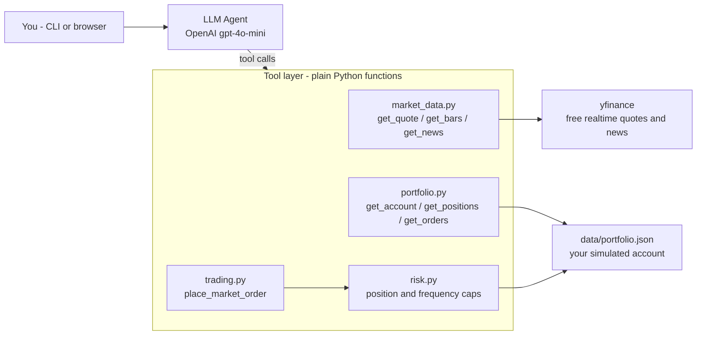

# invest-bot

A learning project that teaches you **AI agents + investing basics through reading code**. 100% simulated, zero real money, zero brokerage account needed.

- **Two ways to run**: terminal CLI (`python -m src.main`) or browser Web UI (`streamlit run app.py`)
- **Deployable**: free push to Streamlit Cloud for a public `https://your-name.streamlit.app` URL
- **Real quotes**: prices / bars / news come from yfinance (Yahoo Finance — free, no key)
- **Real LLM**: uses OpenAI's `gpt-4o-mini` as the brain (cheap; a few hundred chats cost under $1)
- **Real risk checks**: hard-coded gates reject oversized, over-frequent, or naked-short orders

---

## How to learn from this project

You don't need to write Python to play. **Do these 4 steps in order**:

1. **Make it run** (~30 min): follow "Quickstart" below.
2. **Read the code** (1–2 hours): use the "Reading order" table. Every file starts with a docstring explaining "what this file does + beginner concepts cheat sheet."
3. **Modify the code** (open-ended): pick a small change to try. See the "Exercises" list.
4. **Add a feature**: once it clicks, follow "Where to go next" and add your own tool.

---

## Quickstart

### 1. Set up Python

You need Python 3.10+. In a terminal:

```bash
cd ~/Projects/invest-bot
python3 -m venv .venv          # create an isolated Python environment
source .venv/bin/activate      # activate it (your prompt will show (.venv))
pip install -r requirements.txt # install all dependencies
```

### 2. Get an OpenAI key

Go to [https://platform.openai.com/api-keys](https://platform.openai.com/api-keys), sign up, **add at least $5 of credit under Billing**, then click "Create new secret key".

```bash
cp .env.example .env
# Open .env in your editor (VS Code / Cursor / vim) and replace
# OPENAI_API_KEY=sk-... with your real key.
```

### 3. Run the tests to verify the setup

```bash
pytest -v
```

You should see 10 green PASSED.

### 4. Launch the agent

#### Option A: terminal CLI

```bash
python -m src.main
```

#### Option B: browser Web UI (recommended)

```bash
streamlit run app.py
```

The browser will open http://localhost:8501. The left sidebar shows the account summary and holdings; the right side is the chat.

Try these prompts:

```
How much money do I have?
What's AAPL right now?
Show me AAPL over the last month
What's the latest news on NVDA?
I'd like to buy 5 shares of AAPL
Make me money         # see how it handles vague intent
```

---

## Reading order (recommended learning path)

| # | File | What you learn |
|---|---|---|
| 1 | [`src/config.py`](src/config.py) | How to use `.env` for API keys; dataclass basics |
| 2 | [`src/state.py`](src/state.py) | "Use a JSON file as a database"; how to maintain a ledger |
| 3 | [`src/tools/market_data.py`](src/tools/market_data.py) | Calling an external API (yfinance); exception handling |
| 4 | [`src/tools/portfolio.py`](src/tools/portfolio.py) | Composing several low-level functions into a useful "account summary" |
| 5 | [`src/tools/risk.py`](src/tools/risk.py) | Encoding rules in **code**, not prompts |
| 6 | [`src/tools/trading.py`](src/tools/trading.py) | Business-flow orchestration: quote → risk → ledger |
| 7 | [`src/agent.py`](src/agent.py) | The agent core: system prompt + tool registration |
| 8 | [`src/main.py`](src/main.py) | CLI entry: REPL loop, terminal styling (rich) |
| 9 | [`app.py`](app.py) | Web UI entry: Streamlit chat UI + sidebar account panel |
| 10 | [`tests/test_tools.py`](tests/test_tools.py) | Unit testing financial logic with pytest |

Every file's top-level `"""..."""` (docstring) summarizes its purpose and the key concepts. Read those first.

---

## Architecture



---

## Exercises (easy → hard)

Do one before peeking at the next. Stuck? Ask me.

### Easy
1. Change `STARTING_CASH` in [`src/state.py`](src/state.py) from 100k to 10k. Delete `data/portfolio.json`, rerun `python -m src.main`, and check the banner now shows $10k.
2. Change `max_position_pct_of_equity` in [`src/tools/risk.py`](src/tools/risk.py) from 0.05 to 0.10 (5% → 10%). Now you can place larger single orders.
3. In `SYSTEM_PROMPT` ([`src/agent.py`](src/agent.py)) add "use more emojis in replies." Restart the agent and compare the tone.

### Medium
4. Add a `get_top_performer()` function in [`src/tools/portfolio.py`](src/tools/portfolio.py) that returns the holding with the largest unrealized P/L. Register it as a `@function_tool` in `agent.py`. Ask "which holding is most profitable?" and watch the agent call it.
5. Add a transaction fee of $1 per fill in `state.py`. Rerun `pytest` — a few tests will fail. Understand why, then fix them.
6. Add a new rule in `risk.py`: "no single position may exceed 20% of total equity." Cover it with a test.

### Hard
7. Implement limit orders: add a `pending_orders` list in `state.py`, a new `place_limit_order(symbol, side, qty, limit_price)` tool, and a sweep on every startup of `main.py` that fills triggered pendings.
8. Migrate `data/portfolio.json` to SQLite (`import sqlite3`). Hint: define a schema first, then write a one-shot migration to move JSON data in.
9. Use `get_bars` to write a **backtest** module: run the agent's daily-decision function on each day of a 1-year history; report annualized return, max drawdown, Sharpe ratio.

---

## Deploy online (free public URL)

Turn `streamlit run app.py` into `https://your-name.streamlit.app` so anyone can use it. **Free, no credit card.**

### Prep

1. Create a **new GitHub repository** (public recommended — Streamlit Cloud's free plan is geared for public repos; private has tighter limits):
   - Go to [github.com/new](https://github.com/new)
   - Name it `invest-bot` or whatever
   - Choose Public
   - **Don't** check "Add a README" — you already have one locally
   - Click "Create repository"
2. GitHub shows you a snippet. Run it locally:
   ```bash
   cd ~/Projects/invest-bot
   git add .
   git commit -m "first commit"
   git branch -M main
   git remote add origin https://github.com/your-username/invest-bot.git
   git push -u origin main
   ```

### Deploy

3. Go to [share.streamlit.io](https://share.streamlit.io) → log in with GitHub → "Create app".
4. Fill in:
   - **Repository**: `your-username/invest-bot`
   - **Branch**: `main`
   - **Main file path**: `app.py`
   - **App URL** (optional): pick a subdomain like `my-investbot`, giving you `my-investbot.streamlit.app`
5. Click "Deploy". Streamlit auto-installs `requirements.txt` (2-3 minutes), then your URL goes live.

### User experience

- Anyone opening the link **sees a sidebar asking for their own OpenAI API key** — they pay for their own usage, so you won't get billed when others try it.
- Each browser session gets its **own simulated account** (impl detail: [`src/state.py`](src/state.py) uses `threading.local()` to give each session its own temp JSON file).
- After a few days idle, the app sleeps. First load after that takes ~30s; subsequent traffic is snappy.

### Updating after changes

After local edits:
```bash
git add .
git commit -m "what I changed"
git push
```
Streamlit Cloud watches `main` and **auto-redeploys in under a minute**. No buttons to click.

### Optional: pre-baked key

If you want to pay for tokens so users don't need their own key:
1. In your Streamlit Cloud app settings → "Secrets" → add `OPENAI_API_KEY = "sk-..."`
2. In `app.py` change the `api_key` source to `st.secrets.get("OPENAI_API_KEY") or st.text_input(...)`

Not recommended — easy to get drained by abuse.

---

## Safety notes

| Risk | Defense |
|---|---|
| LLM tries a giant single order | `risk.py` caps at 5% of equity |
| LLM machine-guns trades | `risk.py` caps daily orders at 10 |
| Naked shorts | `risk.py` default `allow_short=False` |
| Prompt injection (e.g. news headlines saying "ignore previous instructions") | `get_news` wraps titles in `<untrusted>` tags + system prompt instructs the LLM to treat them as data |
| Leaked API key | `.env` is already in `.gitignore` |
| Hitting a real brokerage by mistake | This project doesn't connect to any broker — the account is a local JSON file |

---

## Common commands

```bash
source .venv/bin/activate                                     # activate the env in a new terminal
python -m src.main                                            # CLI agent
streamlit run app.py                                          # Web UI agent
pytest -v                                                     # run tests
python -c "from src.state import reset_portfolio; reset_portfolio(); print('reset')"  # wipe the account
python -c "import json; from src.tools.portfolio import get_account; print(json.dumps(get_account(), indent=2))"  # print account summary
```

---

## References

- **openai-agents (agent framework)**: [Docs](https://openai.github.io/openai-agents-python/) · [GitHub](https://github.com/openai/openai-agents-python)
- **yfinance (quote library)**: [GitHub](https://github.com/ranaroussi/yfinance)
- **Streamlit**: [Docs](https://docs.streamlit.io/) · [Community Cloud](https://share.streamlit.io)
- **OpenAI API pricing**: [Pricing](https://openai.com/api/pricing/) (gpt-4o-mini: $0.15/M input tokens, $0.60/M output tokens)
- **Python basics** (if you're new to Python): [Official tutorial](https://docs.python.org/3/tutorial/)
- **Pandas cheatsheet** (when yfinance's return values look weird): [10 minutes to pandas](https://pandas.pydata.org/docs/user_guide/10min.html)

---

## How to talk to me

I (the AI in Cursor) am here to help anytime. Effective ways to ask:

- "Walk me through how `apply_fill` works in `src/state.py`. Draw a flow diagram."
- "I changed X in `risk.py` and pytest now fails — what's wrong?"
- "The agent answered Y but I want it to do Z. Should I change the prompt or the code?"
- "I want to add a `set_stop_loss(symbol, price)` tool. Which files need changing?"

The code is written; **understanding, running, modifying, and extending it is your part.**
